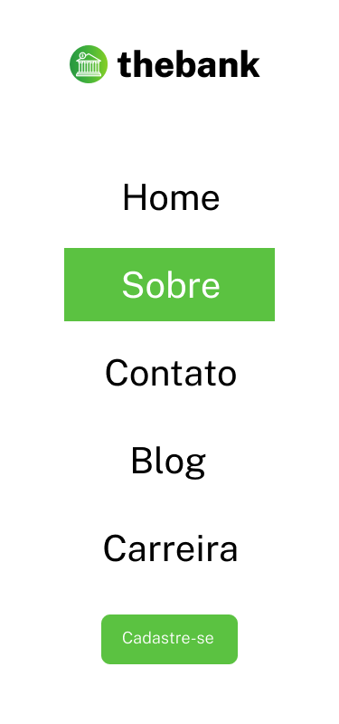
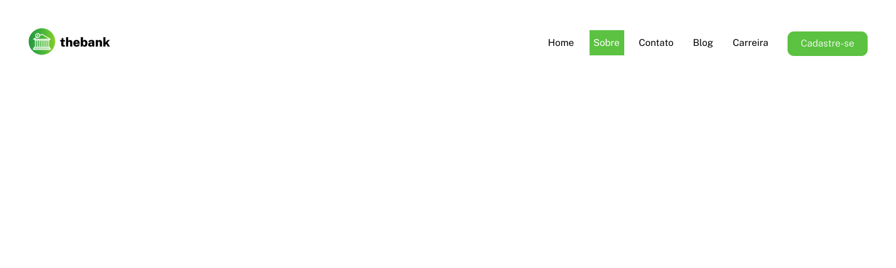

# Menu com flexbox
Um menu para desktop e mobile feito com HTML e CSS usando flexbox.

Intuito desse projeto foi treinar o uso do flexbox. 

Objetivo foi deixar o menu responsivo e bonito tanto em telas desktop como em telas mobiles.

[]

[]

## Tecnologias utilizadas

- HTML
- CSS